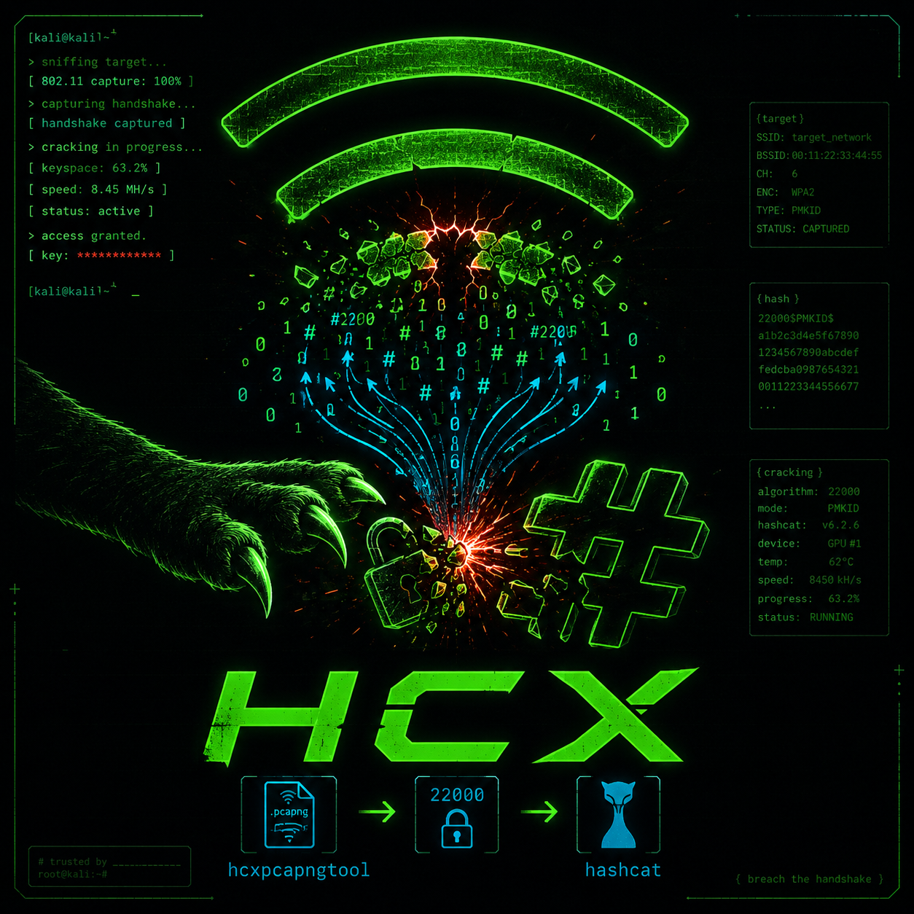

<div align="center">
  
  <h1>HCXFlow</h1>
  <p><b>Capture. Extract. Crack.</b></p>
  <p><i>An advanced, automated framework for WiFi packet capture and decryption.</i></p>
</div>

---

## ⚡ Overview

**HCXFlow** simplifies complex WiFi auditing workflows into an intuitive CLI interface. By wrapping powerful tools like `hcxdumptool`, `hcxpcapngtool`, `hcxhashtool`, and `hashcat`, it provides a seamless experience from capturing packets to cracking hashes.

## ✨ Key Features

- **📡 Dynamic Interface Selection:** Automatically detects and lets you choose available monitor-mode interfaces.
- **⚙️ Automated Workflows:** Perform the entire cycle of capture, conversion, and cracking in one seamless command.
- **🔄 Resumeable Cracking:** Never lose progress. Pause cracking with `Ctrl+C` and resume later using the built-in session management system.
- **⚔️ Flexible Attack Vectors:**
  - 📖 **Dictionary Attack** (using `rockyou.txt` or custom wordlists)
  - 🔗 **Combination Attack**
  - 🎭 **Bruteforce (Mask) Attack**
  - 🧬 **Hybrid Attack** (Dict + Mask)
- **💾 Persistent Results:** All cracked passwords are saved securely in a dedicated `cracked_passwords` directory.

## 🚀 Getting Started

### Prerequisites
Make sure you have the following installed on your system:
- `hcxdumptool`
- `hcxtools`
- `hashcat`
- `python3`

### Execution

Run the script with root privileges to ensure packet capturing works correctly:

```bash
sudo python3 hcx.py
```

## 🛠️ Menu Options

1. **Full:** Automated workflow -> Capture (5 min) ➔ Convert ➔ Crack (Dictionary Attack).
2. **Capture:** Initiate a capture and extract hashes. You can specify a time limit or press `Ctrl+C` to stop manually.
3. **Extract:** Convert existing `.pcapng` captures into hashcat-ready formats.
4. **Crack:** Enter the advanced cracking menu for session management and varied attack types.
5. **Settings:** Configure your wireless interface and wordlist path.
0. **Exit:** Safely terminate the framework.

---
<div align="center">
  <i>Developed for educational and authorized auditing purposes only.</i>
</div>
